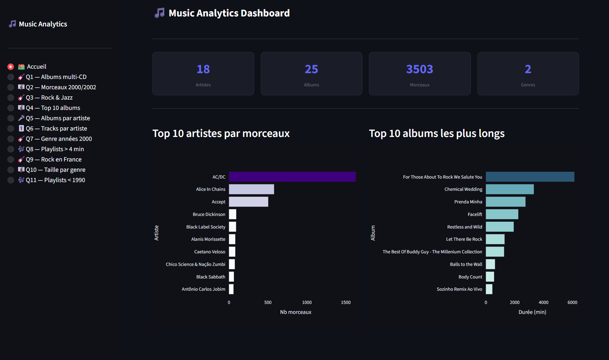

dbt_music — Projet d'évaluation Data Engineering

## Contexte

Ce projet a été réalisé dans le cadre d'un examen de Master Data Engineering.
L'objectif était de maîtriser les outils **dbt Core**, **dbt Cloud** et **Streamlit**
en travaillant sur un jeu de données musicales chargé depuis un bucket S3 dans Snowflake.

---
## Demo

[](https://dbt-music-9bkgyxftjnrqdtszttycnv.streamlit.app/)



## Stack technique

| Outil | Usage |
|---|---|
| **Snowflake** | Data warehouse — stockage et requêtes |
| **dbt Core** | Transformation des données en local |
| **dbt Cloud** | Déploiement et orchestration des modèles |
| **Streamlit** | Dashboard de visualisation des résultats |
| **Python** | Scripts d'export et de vérification |
| **GitHub** | Versioning du projet |

---

## Ce qui a été fait

### 1. Chargement des données (Snowflake)
- Création d'un stage S3 pointant vers `s3://mc-snowflake/sample/music/`
- Création de 7 tables sources normalisées : `Track`, `Album`, `Artist`, `Genre`, `MediaType`, `Playlist`, `PlaylistTrack`
- Peuplement via `COPY INTO` avec gestion des erreurs (`ERROR_ON_COLUMN_COUNT_MISMATCH = FALSE`, `ON_ERROR = CONTINUE`)

### 2. Schéma en étoile (Snowflake)
Transformation du schéma normalisé en schéma en étoile selon la méthode de Kimball :
- **4 dimensions** : `dim_album`, `dim_artist`, `dim_genre`, `dim_mediatype`
- **1 table de faits** : `fact_track` (3503 morceaux)

### 3. Migration vers dbt
Organisation du projet en 3 couches :

```
models/
├── staging/    → 5 vues sur les tables sources (renommage des colonnes)
├── star/       → 4 dimensions + fact_track  [tag: star_schema]
└── queries/    → 11 vues analytiques        [tag: queries]
```

- Utilisation des `{{ ref() }}` pour les dépendances entre modèles
- Tests de qualité dans `schema.yml` (`unique`, `not_null`) — 26 tests passés
- Tags dédiés par couche pour compiler sélectivement

### 4. Requêtes analytiques (11 vues)
| # | Question |
|---|---|
| Q1 | Albums ayant plus d'un CD |
| Q2 | Morceaux produits en 2000 ou 2002 |
| Q3 | Morceaux de Rock et de Jazz |
| Q4 | Top 10 albums les plus longs |
| Q5 | Nombre d'albums par artiste |
| Q6 | Nombre de morceaux par artiste |
| Q7 | Genre le plus représenté dans les années 2000 |
| Q8 | Playlists avec morceaux de plus de 4 minutes |
| Q9 | Morceaux de Rock dont les artistes sont en France |
| Q10 | Taille moyenne des morceaux par genre |
| Q11 | Playlists avec artistes nés avant 1990 |

### 5. dbt Cloud
- Connexion du repo GitHub à dbt Cloud
- Exécution de `dbt run` et `dbt test` depuis l'IDE cloud
- Génération de la documentation avec `dbt docs generate` (dbt Core 1.x)

### 6. Dashboard Streamlit
- Export des résultats Snowflake en `results.json` via `generate_answers.py`
- Dashboard déployé sur Streamlit Cloud depuis ce repo
- Visualisations interactives pour Q4, Q5, Q6, Q10 (Plotly)
- Fonctionne sans connexion Snowflake grâce au fichier `results.json` statique

---

## Structure du projet

```
dbt_music/
├── models/
│   ├── staging/          ← vues sur les tables sources
│   ├── star/             ← schéma en étoile
│   └── queries/          ← 11 requêtes analytiques
├── schema.yml            ← sources, tests, documentation
├── dbt_project.yml       ← configuration dbt
├── app.py                ← dashboard Streamlit
├── results.json          ← données exportées depuis Snowflake
└── requirements.txt      ← dépendances Streamlit
```

---

## Lancer le projet

### dbt (local)
```bash
dbt run                          # compile tous les modèles
dbt run --select tag:star_schema # uniquement le schéma en étoile
dbt run --select tag:queries     # uniquement les requêtes
dbt test                         # lance les 26 tests
```

### Streamlit (local)
```bash
pip install -r requirements.txt
streamlit run app.py
```
